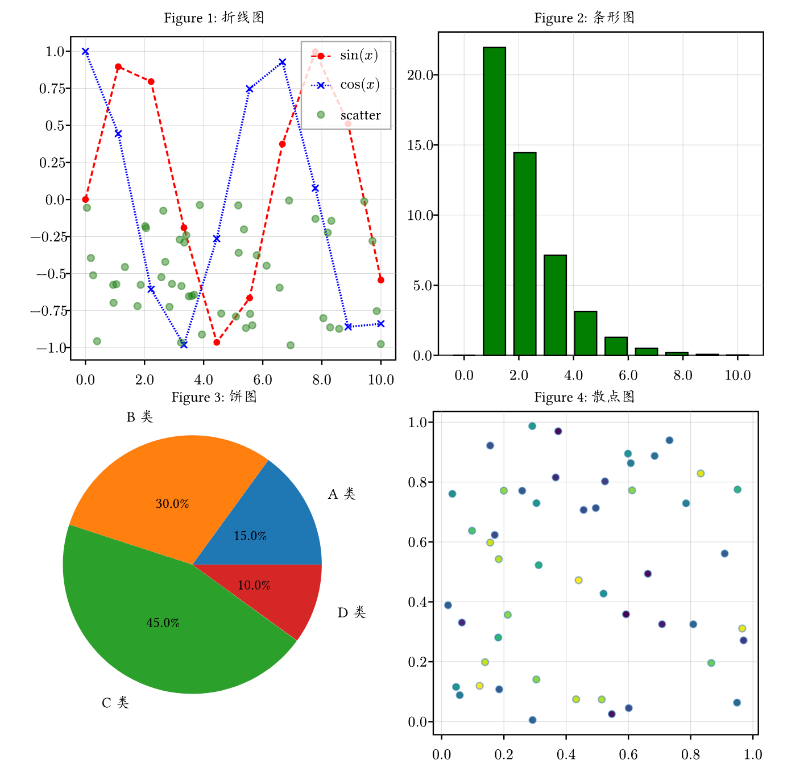

# py2typ

这是一个简易的把Python数据类型组合转换成Typst模块并供Typst直接使用的程序，支持基本数据结构和简易Matplotlib图表的转换

### 示例

```python
from utils.py2typ_module import Py2TypModule
import numpy as np
import matplotlib.pyplot as plt

if __name__ == "__main__":
    obj = {
        "a": 1,
        "b": 2,
        "c": {
            "d": 3,
            "e": 4
        }
    }
    obj2 = {
        "value": 1,
        "name": "test"
    }
    obj3 = [1]

    obj4 = np.array([1, 2, 3, 4])

    typ_module = Py2TypModule("test")
    typ_module.add_variable("obj", obj)
    typ_module.add_variable("obj2", obj2)
    typ_module.add_variable("obj3", obj3)
    typ_module.add_variable("obj4", obj4)


    fig = plt.figure(figsize=(8, 8))

    # 创建2x2的子图布局
    ax1 = plt.subplot(221)  # 折线图
    ax2 = plt.subplot(222)  # 条形图
    ax3 = plt.subplot(223)  # 饼图
    ax4 = plt.subplot(224)  # 散点图

    # 生成数据
    x = np.linspace(0, 10, 10)
    y1 = np.sin(x)
    y2 = np.cos(x)

    # 折线图
    ax1.plot(x, y1, label="$sin(x)$", color="r", linestyle="--", marker="o")
    ax1.plot(x, y2, label="$cos(x)$", color="b", linestyle=":", marker="x")
    x_scatter = np.random.rand(50) * 10
    y_scatter = np.random.rand(50) - 1
    ax1.scatter(x_scatter, y_scatter, c="g", alpha=0.5, label="scatter")
    ax1.set_title("折线图")
    ax1.legend()

    # 条形图
    ax2.bar(x, x*np.exp(-x) * 60, label="$x e^(-x)$", color="g")
    ax2.set_title("条形图")
    ax2.legend()

    # 饼图
    sizes = [15, 30, 45, 10]
    labels = ['A类', 'B类', 'C类', 'D类']
    ax3.pie(sizes, labels=labels, autopct='%1.1f%%')
    ax3.set_title("饼图")

    # 散点图
    np.random.seed(42)
    x_scatter = np.random.rand(50)
    y_scatter = np.random.rand(50)
    colors = np.random.rand(50)
    ax4.scatter(x_scatter, y_scatter, c=colors, alpha=0.5)
    ax4.set_title("散点图")

    # 调整布局
    plt.tight_layout()
    plt.suptitle("多图表示例", y=1.02)
    fig = plt.gcf()
    typ_module.add_variable("plot", fig)
    typ_module.save()
    plt.show()

```

```typst
#import "test.typ" as test
#import "@preview/cuti:0.3.0": show-cn-fakebold 
#show: show-cn-fakebold
#set page(width: auto, height: auto)
#align(center, test.plot)
```


